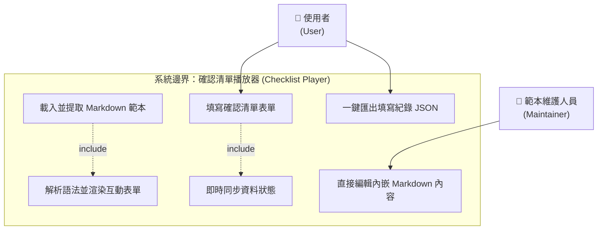
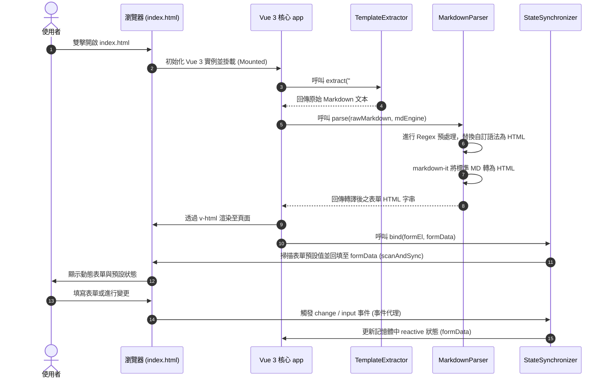

# 確認清單播放器 (Checklist Player)

這是一個**完全免伺服器 (Zero-Server)、雙擊即開、純離線**的單一 HTML 確認清單播放器。系統能即時讀取內嵌的 Markdown (MD) 清單範本並渲染為具備動態互動與美觀樣式的 HTML 表單。使用者填寫完畢後，資料可於地端結構化導出為包含時間戳記的 JSON 檔案。

---

## 1. 核心特色 (Core Features)

*   **純離線運作 (Zero-Server)**：不依賴任何後端伺服器與本地託管服務，雙擊 `index.html` 即可在瀏覽器（以 `file:///` 協定）完美運行。
*   **零門檻範本維護**：非程式人員只需用文字編輯器修改 HTML 最下方的 Markdown 區塊，即可完成題目的修改與發布。
*   **雙向事件代理同步**：利用原生 JS 事件代理（Event Delegation），即便是在 Vue 3 `v-html` 動態渲染的 DOM 結構中，亦能達到反應式資料的即時雙向同步。
*   **高品質 UI/UX**：整合 Tailwind CSS，具備卡片式圓角陰影、平滑輸入反饋以及**即時 JSON 資料預覽區**（具備動態高亮同步指示器）。
*   **100% 模組化與單元測試**：核心邏輯拆分為四大職責單一的 JavaScript 模組，並提供 16 個 100% 覆蓋的 Vitest 自動化單元測試。

---

## 2. 使用手冊 (User Manual)

### 2.1 啟動播放器
直接進入專案目錄，雙擊開啟 [index.html](file:///c:/MyProg/AI/CheckListMD/index.html) 檔案，即可在您的預設瀏覽器中載入播放器。

### 2.2 清單填寫與匯出
1.  **填寫表單**：可在畫面上輸入負責人與 IP、勾選複選項目、選擇單選鈕，以及填寫備註。
2.  **即時預覽**：底部的 `LIVE JSON DATA PREVIEW` 區域會即時顯示目前收集到的 JSON 資料結構，方便確認狀態。
3.  **一鍵匯出**：點擊 **「一鍵下載 JSON 紀錄」** 按鈕，瀏覽器會將填寫結果序列化，並自動觸發下載為 `.json` 實體檔案。
    *   *檔案命名規則：* `checklist-YYYYMMDD.json` (例如 `checklist-20260523.json`)。
    *   *匯出資料結構範例：*
        ```json
        {
          "export_at": "2026/5/23 下午 10:00:00",
          "results": {
            "驗收負責人": "專案人員A",
            "佈署伺服器 IP": "192.168.1.100",
            "CPU 核心數與記憶體大小符合契約規格 (例如: 8C/32G)": true,
            "地端防火牆連接埠 (80, 443, 22) 已開啟": false,
            "系統硬碟與資料硬碟分割區已正確掛載": true,
            "NTP 伺服器時間同步正常": false,
            "佈署類型": "覆蓋升級 (Upgrade)",
            "備註與異常說明": "本地測試完全正常。"
          }
        }
        ```

### 2.3 題目範本修改方法 (非技術人員適用)
使用任何文字編輯器（如 Notepad++、VS Code、記事本）開啟 [index.html](file:///c:/MyProg/AI/CheckListMD/index.html)，拉到檔案最下方，修改 `<script id="markdown-template" type="text/markdown">` 標籤中的 Markdown 內容，存檔後重新整理瀏覽器即可！

*   **支援的題目語法規格：**
    *   **複選題**：`- [ ] 題目文字`（已選取則為 `- [x] 題目文字`）。
    *   **單選題**：`( ) 群組名稱：選項文字`（已選取則為 `(x) 群組名稱：選項文字` 或 `(*) 群組名稱：選項文字`）。
    *   **單行問答**：`[text: 欄位名稱]`。
    *   **多行問答**：`[textarea: 欄位名稱]`。

---

## 3. 技術說明 (Technical Specifications)

### 3.1 使用案例圖 (Use Case Diagram)

使用案例圖說明了外部參與者（Actors）與系統功能之間的關係。此圖以 Mermaid `flowchart TD` 渲染：



### 3.2 運作時序圖 (Runtime Sequence)



### 3.3 核心模組職責說明 (Core Modules)

為落實「高獨立性與易測試性」，專案內的 JavaScript 劃分為四個獨立模組（位於 `src/modules/` 下）：

1.  **`TemplateExtractor`**：
    *   *職責：* 從指定的 DOM 元素中提取 text 內容。
    *   *特點：* 優先讀取 `textContent`，防止特殊字元（如 `<`、`>`）被瀏覽器轉義為 HTML Entity。
2.  **`MarkdownParser`**：
    *   *職責：* 自訂語法與標準 Markdown 語法的解析。
    *   *特點：* 使用正則表示式預先將自訂語法轉換為帶有 `name`、`value` 與 `data-type` 的 HTML 控制項，再經由 `markdown-it` 編譯。
3.  **`StateSynchronizer`**：
    *   *職責：* 將動態 DOM 的狀態與 Vue `formData` 雙向同步。
    *   *特點：* 在表單容器上掛載事件代理，即時捕捉並過濾不同型態元件的 `change`/`input` 事件，並提供 `scanAndSync` 以支援初始預選值回填。
4.  **`DataExporter`**：
    *   *職責：* 處理 JSON 資料格式化與瀏覽器端下載。
    *   *特點：* 將時間戳記格式化為台灣習慣的 `YYYY/M/D 下午 H:mm:ss`，將資料深拷貝至 `results` 節點後，利用 Blob 觸發下載。

---

## 4. 開發與單元測試指引 (Development & Testing)

### 4.1 Environment Requirements
本專案的自動化單元測試需要本地具備 **Node.js** 環境（建議安裝 LTS 最新版）。

### 4.2 依賴安裝
在專案根目錄下，執行終端機命令安裝 Vitest 與 JSDOM 測試環境依賴：
```bash
npm install
```

### 4.3 執行單元測試
執行以下命令以啟動單元測試：
```bash
npm run test
```
該命令將使用 Vitest 執行 `test/` 目錄下的 4 個測試套件共計 16 個單元測試，驗證提取、解析、同步與匯出模組的行為是否正確。

---

## 5. 專案檔案結構 (File Structure)

```plaintext
c:\MyProg\AI\CheckListMD\
├── doc\
│   ├── proposal.md               (需求規格書)
│   ├── detail-design.md          (詳細設計說明書)
│   ├── prompt.md                 (Vibe Coding 啟動指令)
│   ├── walkthrough.md            (開發總結與操作指南)
│   └── tasks\
│       ├── progress.md           (總進度追蹤表)
│       └── <module-name>.md      (各模組詳細子任務清單)
├── src\
│   └── modules\
│       ├── TemplateExtractor.js  (模組實作)
│       ├── MarkdownParser.js     (模組實作)
│       ├── StateSynchronizer.js  (模組實作)
│       └── DataExporter.js       (模組實作)
├── test\
│   ├── TemplateExtractor.test.js (單元測試)
│   ├── MarkdownParser.test.js    (單元測試)
│   ├── StateSynchronizer.test.js (單元測試)
│   └── DataExporter.test.js      (單元測試)
├── package.json                  (npm 與測試命令設定檔)
├── README.md                     (本技術手冊)
└── index.html                    (整合型單一播放器 HTML 網頁)
```
