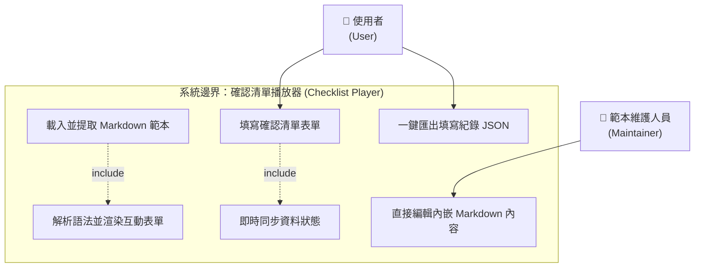
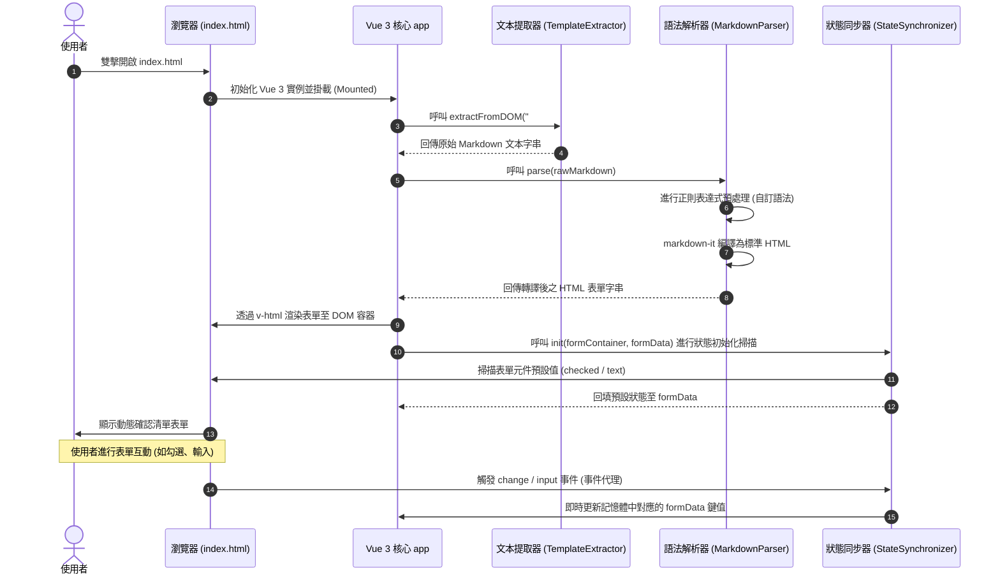
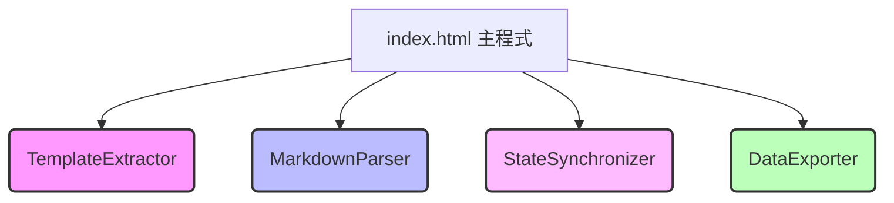

# 概要與詳細設計說明書 (Detail Design Specification) - 確認清單播放器

本文件基於需求規格書 [proposal.md](file:///c:/MyProg/AI/CheckListMD/doc/proposal.md) 進行系統架構與詳細模組設計。本系統為單一 HTML（Zero-Server）離線確認清單播放器，採用 Vue 3、markdown-it 與 Tailwind CSS 技術棧，旨在提供無伺服器相依的純離線確認清單渲染與填寫匯出功能。

---

## 1. 系統架構與運作流程 (System Architecture & Workflow)

本系統僅包含單一實體 HTML 檔案（`index.html`）。為實現模組解耦、便於維護與獨立測試，系統內部的 JavaScript 邏輯將被劃分為數個職責單一的模組（Modules），並在初始化時進行協調調用。

### 1.1 使用案例圖 (Use Case Diagram)

使用案例圖說明了本系統的外部參與者（Actors）與系統功能（Use Cases）之間的互動關係：



- **使用者 (User)**：主要操作者，負責雙擊開啟播放器、在瀏覽器上進行清單的點選與填寫，並在完成後下載匯出 JSON 紀錄檔。
- **範本維護人員 (Maintainer)**：非程式開發人員，僅需透過任何文字編輯器，即可直接修改 `index.html` 內嵌的 Markdown 區塊以調整清單題目。

### 1.2 檔案組織結構（完全離線模式）

在完全離線斷網部署環境下，推薦採用以下目錄結構。所有外部依賴項皆放置於本地 `lib` 中，以相對路徑引用：

```plaintext
c:\MyProg\AI\CheckListMD\
├── doc\
│   ├── proposal.md       (需求規格書)
│   └── detail-design.md  (本設計文件)
├── lib\                  (本地靜態相依庫)
│   ├── vue.global.prod.js
│   ├── markdown-it.min.js
│   └── tailwind.min.css
└── index.html            (整合主程式、解析引擎與 Markdown 範本之單一檔案)
```

### 1.3 運作時序圖 (Runtime Sequence)



---

## 2. 模組劃分與獨立性設計 (Module Decomposition)

為使模組之間保持高度獨立性、易於維護且可進行獨立單元測試，我們將 JavaScript 邏輯拆分為以下四個核心模組。各模組不直接依賴 Vue 實例的內部狀態，而是透過傳入參數與回傳值進行交互。



### 2.1 模組清單與職責

| 模組名稱 | 職責說明 | 獨立測試方法 |
| :--- | :--- | :--- |
| **MD 文本提取器**<br>`TemplateExtractor` | 從 DOM 節點中安全擷取 `<script>` 的 text 內容，並處理可能存在的 HTML 轉義字元。 | 傳入模擬的 DOM 元素，驗證提取出的字串是否與預期一致。 |
| **MD 語法解析器**<br>`MarkdownParser` | 將 Markdown 文本（包含標準語法與自訂語法）解析並轉換為包含對應屬性（`name`, `value`, `data-type`）的 HTML 表單標籤。 | 輸入特定 Markdown 字串，斷言（Assert）輸出的 HTML 是否符合規格。 |
| **狀態同步器**<br>`StateSynchronizer` | 監聽表單容器的 `change` 和 `input` 事件，以事件代理方式將表單異動即時更新回資料物件中，並掃描初始化狀態。 | 使用 JSDOM 或模擬事件，測試觸發事件後資料結構是否正確寫入。 |
| **資料匯出器**<br>`DataExporter` | 將目前的資料狀態序列化，封裝成 Blob 並觸發瀏覽器下載為 JSON 檔案。 | 傳入資料物件，驗證產出的 JSON 格式與檔名生成邏輯。 |

---

## 3. 模組詳細設計 (Detailed Module Specifications)

### 3.1 MD 文本提取器 (TemplateExtractor)

本模組負責從指定的 `<script type="text/markdown">` 標籤中讀取原始 Markdown 字串。

#### 介面定義
```javascript
const TemplateExtractor = {
  /**
   * 從指定的 selector 讀取原始 Markdown 內容
   * @param {string} selector - CSS 選擇器，例如 '#markdown-template'
   * @returns {string} 原始 Markdown 文本
   */
  extract(selector) {
    const element = document.querySelector(selector);
    if (!element) {
      throw new Error(`找不到指定的範本標籤: ${selector}`);
    }
    // 優先使用 textContent 以避免 innerHTML 自動將特殊字元轉義
    return element.textContent || element.innerText || '';
  }
};
```

---

### 3.2 MD 語法解析器 (MarkdownParser)

本模組使用**正則表達式（Regex）預處理策略**，在將 Markdown 內容送入 `markdown-it` 解析前，先將自訂的確認清單、單選、問答語法替換為對應的 HTML 標籤。

#### 3.2.1 語法轉換規則與 Regex 定義

##### 1. 複選題 (Checkbox)
*   **需求語法**：
    *   未選取：`- [ ] 題目文字`
    *   預設選取：`- [x] 題目文字` 或 `- [X] 題目文字`
*   **Regex 定義**：
    *   未選取匹配：`/^-\s+\[\s*\]\s+(.+)$/gm`
    *   已選取匹配：`/^-\s+\[[xX]\]\s+(.+)$/gm`
*   **轉換 HTML 對照**：
    *   未選取：`<input type="checkbox" name="$1" data-type="checkbox" class="form-checkbox h-5 w-5 text-blue-600 rounded border-gray-300 focus:ring-blue-500"> $1`
    *   已選取：`<input type="checkbox" name="$1" data-type="checkbox" checked class="form-checkbox h-5 w-5 text-blue-600 rounded border-gray-300 focus:ring-blue-500"> $1`

##### 2. 單選題 (Radio)
*   **需求語法**：
    *   未選取：`( ) 群組名稱：選項文字`
    *   預設選取：`(x) 群組名稱：選項文字` 或 `(*) 群組名稱：選項文字`
*   **Regex 定義**：
    *   未選取匹配：`/\(\s*\)\s*([^：\n]+)：([^：\n]+)/g`
    *   已選取匹配：`/\([xX*]\)\s*([^：\n]+)：([^：\n]+)/g`
*   **轉換 HTML 對照**：
    *   未選取：`<input type="radio" name="$1" value="$2" data-type="radio" class="form-radio h-5 w-5 text-blue-600 border-gray-300 focus:ring-blue-500"> $2`
    *   已選取：`<input type="radio" name="$1" value="$2" data-type="radio" checked class="form-radio h-5 w-5 text-blue-600 border-gray-300 focus:ring-blue-500"> $2`

##### 3. 單行問答 (Text Input)
*   **需求語法**：`[text: 提示欄位名]`
*   **Regex 定義**：`/\[text:\s*([^\]]+)\]/g`
*   **轉換 HTML 對照**：
    `<input type="text" name="$1" placeholder="$1" data-type="text" class="form-input mt-1 block w-full rounded-md border-gray-300 shadow-sm focus:border-blue-500 focus:ring focus:ring-blue-200 focus:ring-opacity-50">`

##### 4. 多行問答 (Textarea Input)
*   **需求語法**：`[textarea: 提示欄位名]`
*   **Regex 定義**：`/\[textarea:\s*([^\]]+)\]/g`
*   **轉換 HTML 對照**：
    `<textarea name="$1" placeholder="$1" data-type="textarea" rows="3" class="form-textarea mt-1 block w-full rounded-md border-gray-300 shadow-sm focus:border-blue-500 focus:ring focus:ring-blue-200 focus:ring-opacity-50"></textarea>`

#### 3.2.2 模組實作結構

```javascript
const MarkdownParser = {
  /**
   * 解析 Markdown 文本，預處理自訂語法後交由 markdown-it 渲染為 HTML
   * @param {string} markdownText - 原始 Markdown 文本
   * @param {object} mdEngine - markdown-it 的實例
   * @returns {string} 渲染後的 HTML 表單內容
   */
  parse(markdownText, mdEngine) {
    if (!markdownText) return '';
    
    let processedText = markdownText;

    // 1. 處理複選題預選 (- [x] 題目文字)
    processedText = processedText.replace(/^-\s+\[[xX]\]\s+(.+)$/gm, (match, title) => {
      const cleanTitle = title.trim();
      return `<div class="flex items-center my-2"><input type="checkbox" name="${cleanTitle}" data-type="checkbox" checked class="form-checkbox h-5 w-5 text-blue-600 rounded border-gray-300 focus:ring-blue-500"><span class="ml-2">${cleanTitle}</span></div>`;
    });

    // 2. 處理複選題未選 (- [ ] 題目文字)
    processedText = processedText.replace(/^-\s+\[\s*\]\s+(.+)$/gm, (match, title) => {
      const cleanTitle = title.trim();
      return `<div class="flex items-center my-2"><input type="checkbox" name="${cleanTitle}" data-type="checkbox" class="form-checkbox h-5 w-5 text-blue-600 rounded border-gray-300 focus:ring-blue-500"><span class="ml-2">${cleanTitle}</span></div>`;
    });

    // 3. 處理單選題預選 ((x) 群組名稱：選項文字)
    processedText = processedText.replace(/\([xX*]\)\s*([^：\n]+)：([^：\n]+)/g, (match, group, option) => {
      const cleanGroup = group.trim();
      const cleanOption = option.trim();
      return `<label class="inline-flex items-center mr-4 my-1"><input type="radio" name="${cleanGroup}" value="${cleanOption}" data-type="radio" checked class="form-radio h-5 w-5 text-blue-600 border-gray-300 focus:ring-blue-500"><span class="ml-2">${cleanOption}</span></label>`;
    });

    // 4. 處理單選題未選 (( ) 群組名稱：選項文字)
    processedText = processedText.replace(/\(\s*\)\s*([^：\n]+)：([^：\n]+)/g, (match, group, option) => {
      const cleanGroup = group.trim();
      const cleanOption = option.trim();
      return `<label class="inline-flex items-center mr-4 my-1"><input type="radio" name="${cleanGroup}" value="${cleanOption}" data-type="radio" class="form-radio h-5 w-5 text-blue-600 border-gray-300 focus:ring-blue-500"><span class="ml-2">${cleanOption}</span></label>`;
    });

    // 5. 處理多行問答 [textarea: 提示欄位名]
    processedText = processedText.replace(/\[textarea:\s*([^\]]+)\]/g, (match, label) => {
      const cleanLabel = label.trim();
      return `<div class="my-3"><label class="block text-sm font-medium text-gray-700">${cleanLabel}</label><textarea name="${cleanLabel}" placeholder="${cleanLabel}" data-type="textarea" rows="3" class="mt-1 block w-full rounded-md border-gray-300 shadow-sm focus:border-blue-500 focus:ring focus:ring-blue-200 focus:ring-opacity-50"></textarea></div>`;
    });

    // 6. 處理單行問答 [text: 提示欄位名]
    processedText = processedText.replace(/\[text:\s*([^\]]+)\]/g, (match, label) => {
      const cleanLabel = label.trim();
      return `<div class="my-3"><label class="block text-sm font-medium text-gray-700">${cleanLabel}</label><input type="text" name="${cleanLabel}" placeholder="${cleanLabel}" data-type="text" class="mt-1 block w-full rounded-md border-gray-300 shadow-sm focus:border-blue-500 focus:ring focus:ring-blue-200 focus:ring-opacity-50"></div>`;
    });

    // 7. 最後交由 markdown-it 解析標準 Markdown 標籤 (標題、段落等)
    // 由於我們產出了 HTML 標籤，markdown-it 必須啟用 html: true 選項
    return mdEngine.render(processedText);
  }
};
```

---

### 3.3 狀態同步器 (StateSynchronizer)

因為轉譯後的 HTML 是以 `v-html` 動態寫入 DOM，Vue 3 的模板編譯器無法在編譯期為其綁定 `v-model`。本模組實作**事件代理（Event Delegation）**與**初始化狀態掃描**，將使用者輸入即時寫入反應式資料（Reactive State）。

#### 3.3.1 核心流程與事件處理邏輯

1.  **監聽階段**：在表單容器 DOM 節點上註冊監聽 `change` 事件（對於文字輸入，可搭配監聽 `input` 事件以達成即時同步）。
2.  **提取資訊**：當事件觸發時，透過 `event.target` 獲取觸發的元素：
    *   必須包含 `name` 屬性，此屬性即為 JSON 的 Key。
    *   根據元素的 `data-type` 屬性（或 `type` 屬性）來判斷資料儲存類型。
3.  **同步規則**：
    *   `checkbox`：`formData[name] = target.checked` (布林值)
    *   `radio`：`formData[name] = target.value` (當前選中項目的字串值)
    *   `text` / `textarea`：`formData[name] = target.value` (使用者輸入字串)

#### 3.3.2 初始狀態掃描 (Initialization Scan)
表單渲染完畢後，必須主動掃描容器內的所有輸入項，將其預設值同步回資料物件中，避免使用者在未更改任何欄位的情況下直接匯出，導致 JSON 資料缺失。

#### 3.3.3 模組實作結構

```javascript
const StateSynchronizer = {
  /**
   * 初始化事件監聽與資料綁定
   * @param {HTMLElement} container - 表單容器的 DOM 元素
   * @param {object} formDataRef - Vue reactive 狀態物件的引用
   */
  bind(container, formDataRef) {
    if (!container) return;

    // 清除舊資料以重新初始化
    for (const key in formDataRef) {
      delete formDataRef[key];
    }

    // 1. 執行初始掃描，將畫面上已有的預設值回填至 formDataRef
    this.scanAndSync(container, formDataRef);

    // 2. 監聽 change 事件（適用於 Checkbox, Radio, 以及完成輸入的 Text/Textarea）
    container.addEventListener('change', (event) => {
      this.handleEvent(event, formDataRef);
    });

    // 3. 監聽 input 事件（針對 Text 與 Textarea，提供即時字元同步）
    container.addEventListener('input', (event) => {
      const target = event.target;
      const dataType = target.getAttribute('data-type');
      if (dataType === 'text' || dataType === 'textarea') {
        this.handleEvent(event, formDataRef);
      }
    });
  },

  /**
   * 處理輸入與變更事件並同步資料
   */
  handleEvent(event, formDataRef) {
    const target = event.target;
    const name = target.getAttribute('name');
    if (!name) return;

    const dataType = target.getAttribute('data-type') || target.type;

    if (dataType === 'checkbox') {
      formDataRef[name] = target.checked;
    } else if (dataType === 'radio') {
      if (target.checked) {
        formDataRef[name] = target.value;
      }
    } else {
      formDataRef[name] = target.value;
    }
  },

  /**
   * 掃描表單中所有帶有 name 的控制項，並同步其初始值
   */
  scanAndSync(container, formDataRef) {
    const inputs = container.querySelectorAll('[name]');
    inputs.forEach((input) => {
      const name = input.getAttribute('name');
      const dataType = input.getAttribute('data-type') || input.type;

      if (dataType === 'checkbox') {
        // Checkbox 初始化：僅當被 checked 時為 true，未選取預設可設為 false
        formDataRef[name] = input.checked;
      } else if (dataType === 'radio') {
        // Radio 初始化：只有被 checked 的那個 radio 的值會成為該 name 的 value
        if (input.checked) {
          formDataRef[name] = input.value;
        } else if (formDataRef[name] === undefined) {
          // 若無任何選取，預設給予空字串或不寫入
          formDataRef[name] = '';
        }
      } else {
        // Text / Textarea 初始化
        formDataRef[name] = input.value || '';
      }
    });
  }
};
```

---

### 3.4 資料匯出器 (DataExporter)

本模組負責將記憶體中的 `formData` 封裝，格式化為符合要求的輸出 JSON schema，並透過 Blob 觸發下載。

#### 介面定義
```javascript
const DataExporter = {
  /**
   * 格式化時間戳記為 YYYY/M/D 下午 H:mm:ss 的格式
   * @returns {string} 格式化後的時間
   */
  getFormattedTime() {
    const now = new Date();
    // 依需求產生符合規格的格式："2026/5/23 下午 9:40:00"
    const datePart = `${now.getFullYear()}/${now.getMonth() + 1}/${now.getDate()}`;
    const hours = now.getHours();
    const ampm = hours >= 12 ? '下午' : '上午';
    const displayHours = hours % 12 === 0 ? 12 : hours % 12;
    const minutes = String(now.getMinutes()).padStart(2, '0');
    const seconds = String(now.getSeconds()).padStart(2, '0');
    
    return `${datePart} ${ampm} ${displayHours}:${minutes}:${seconds}`;
  },

  /**
   * 執行資料匯出並觸發瀏覽器下載
   * @param {object} formData - 填寫的表單資料物件
   */
  exportToJSON(formData) {
    const exportData = {
      export_at: this.getFormattedTime(),
      results: { ...formData }
    };

    const jsonString = JSON.stringify(exportData, null, 2);
    const blob = new Blob([jsonString], { type: 'application/json;charset=utf-8;' });
    
    // 生成檔名：checklist-YYYYMMDD.json
    const now = new Date();
    const yyyy = now.getFullYear();
    const mm = String(now.getMonth() + 1).padStart(2, '0');
    const dd = String(now.getDate()).padStart(2, '0');
    const filename = `checklist-${yyyy}${mm}${dd}.json`;

    // 建立臨時載體觸發下載
    const link = document.createElement('a');
    if (link.download !== undefined) {
      const url = URL.createObjectURL(blob);
      link.setAttribute('href', url);
      link.setAttribute('download', filename);
      link.style.visibility = 'hidden';
      document.body.appendChild(link);
      link.click();
      document.body.removeChild(link);
      URL.revokeObjectURL(url);
    } else {
      console.error('您的瀏覽器不支援直接下載檔案。');
    }
  }
};
```

---

## 4. 數據結構規格 (Data Schema)

匯出的 JSON 結構嚴格遵循以下 Schema：

```json
{
  "$schema": "http://json-schema.org/draft-07/schema#",
  "title": "ChecklistExport",
  "type": "object",
  "required": ["export_at", "results"],
  "properties": {
    "export_at": {
      "type": "string",
      "description": "匯出時的時間戳記，格式為 YYYY/M/D 上/下午 H:MM:SS"
    },
    "results": {
      "type": "object",
      "description": "各確認清單欄位之最終值對應表",
      "additionalProperties": {
        "anyOf": [
          { "type": "boolean" },
          { "type": "string" }
        ]
      }
    }
  }
}
```

---

## 5. UI/UX 與樣式設計 (UI/UX Design)

本系統完全採用 **Tailwind CSS** 的表單美化設計。

1.  **容器卡片樣式**：採用白底圓角陰影（`bg-white shadow-xl rounded-lg`），整體置中對齊，搭配深灰背景底色（`bg-gray-100`），營造精緻質感。
2.  **表單控制項樣式**：
    *   **複選框 (Checkbox)** 與 **單選鈕 (Radio)**：設定為 `text-blue-600`，在 Focus 時搭配 `focus:ring-blue-500` 藍色光暈效果。
    *   **輸入框 (Text/Textarea)**：採用輕度圓角與淡灰邊框（`border-gray-300 focus:border-blue-500 focus:ring-blue-200`），提供平滑的過渡與輸入反饋。
3.  **動作按鈕**：
    *   **匯出 JSON 按鈕**：採用漸層色調（`bg-gradient-to-r from-blue-600 to-indigo-600 hover:from-blue-700 hover:to-indigo-700`），具備陰影與微浮動動畫，點擊時有 active 壓下效果。

---

## 6. 模組獨立單元測試方案 (Unit Testing Plan)

為貫徹「模組與模組之間保持相互獨立、可獨立測試」之核心原則，我們設計了獨立於瀏覽器環境之單元測試架構。在開發環境中，可使用 Node.js 與主流測試框架（如 **Vitest**）在終端機中運行。

### 6.1 測試環境相依
於 `package.json` 中配置測試依賴（不影響單一 HTML 的線上部署）：
```json
{
  "devDependencies": {
    "vitest": "^1.0.0",
    "jsdom": "^22.0.0"
  }
}
```

### 6.2 語法解析器測試案例 (`test/parser.test.js`)
本測試不依賴瀏覽器 DOM，可於 Node 終端機直接測試：

```javascript
import { describe, it, expect, beforeEach } from 'vitest';
import { MarkdownParser } from '../src/modules/MarkdownParser.js'; // 假定模組獨立抽離

// 模擬 markdown-it 實例
const mockMdEngine = {
  render: (text) => text // 僅返回處理後的文字以方便比對 HTML 預處理結果
};

describe('MarkdownParser - 自訂語法解析測試', () => {
  it('應正確解析複選題（未選取與預選）', () => {
    const raw = "- [ ] 項目 A\n- [x] 項目 B";
    const result = MarkdownParser.parse(raw, mockMdEngine);
    
    expect(result).toContain('type="checkbox"');
    expect(result).toContain('name="項目 A"');
    expect(result).not.toContain('name="項目 A" checked');
    
    expect(result).toContain('name="項目 B"');
    expect(result).toContain('checked');
  });

  it('應正確解析單選題（未選取與預選）', () => {
    const raw = "( ) 部署模式：全新安裝\n(x) 部署模式：覆蓋升級";
    const result = MarkdownParser.parse(raw, mockMdEngine);
    
    expect(result).toContain('type="radio"');
    expect(result).toContain('name="部署模式"');
    expect(result).toContain('value="全新安裝"');
    expect(result).toContain('value="覆蓋升級"');
    expect(result).toContain('checked'); // 覆蓋升級應有 checked 屬性
  });

  it('應正確解析問答題（單行與多行）', () => {
    const raw = "[text: 負責人]\n[textarea: 備註]";
    const result = MarkdownParser.parse(raw, mockMdEngine);
    
    expect(result).toContain('<input type="text" name="負責人"');
    expect(result).toContain('<textarea name="備註"');
  });
});
```

### 6.3 狀態同步器測試案例 (`test/synchronizer.test.js`)
此測試使用 `jsdom` 模擬瀏覽器 DOM 環境，驗證事件代理與狀態回填：

```javascript
import { describe, it, expect } from 'vitest';
import { StateSynchronizer } from '../src/modules/StateSynchronizer.js';

describe('StateSynchronizer - 狀態同步與事件代理測試', () => {
  it('scanAndSync 應正確掃描 DOM 元件並初始化資料狀態', () => {
    // 建立模擬 DOM 容器
    const container = document.createElement('div');
    container.innerHTML = `
      <input type="checkbox" name="項目A" data-type="checkbox" checked>
      <input type="radio" name="群組A" value="選項1" data-type="radio">
      <input type="radio" name="群組A" value="選項2" data-type="radio" checked>
      <input type="text" name="聯絡人" data-type="text" value="王大明">
    `;
    
    const formData = {};
    StateSynchronizer.scanAndSync(container, formData);
    
    expect(formData['項目A']).toBe(true);
    expect(formData['群組A']).toBe('選項2');
    expect(formData['聯絡人']).toBe('王大明');
  });

  it('handleEvent 應在接收變更事件後即時更新資料狀態', () => {
    const container = document.createElement('div');
    const input = document.createElement('input');
    input.setAttribute('type', 'text');
    input.setAttribute('name', '主管姓名');
    input.setAttribute('data-type', 'text');
    input.value = '張經理';
    container.appendChild(input);

    const formData = { '主管姓名': '' };
    
    // 模擬 change 事件
    const event = { target: input };
    StateSynchronizer.handleEvent(event, formData);
    
    expect(formData['主管姓名']).toBe('張經理');
  });
});
```
