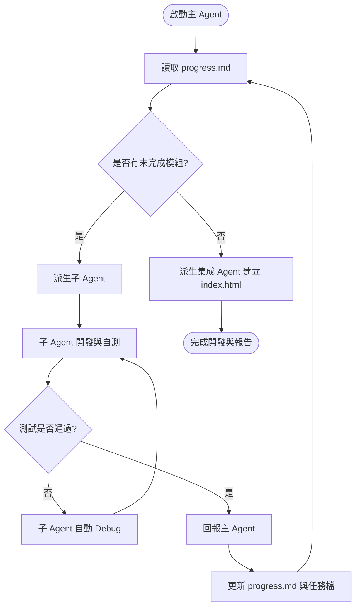

# 自動化多 Agent 開發啟動 Prompt (Automated Multi-Agent Bootstrap Prompt)

本文件是「確認清單播放器」專案的自動化啟動 Prompt。請作為**主 Agent (Coordinator/Master Agent)** 讀取此文件，並全權主導整個專案的初始化、模組化開發、自動測試與系統整合。**整個過程不會有人工參與。**

---

## 1. 系統角色定義 (System Role Definitions)

### 1.1 主 Agent (Master/Coordinator Agent)
*   **定位**：專案經理（PM）與總架構師（Master Architect）。
*   **職責**：
    1. 管理整體開發流程，維護並更新 [progress.md](file:///c:/MyProg/AI/CheckListMD/doc/tasks/progress.md) 的進度。
    2. 自動化初始化專案開發與測試環境（Node.js, npm, Vitest）。
    3. 針對各模組派生（Spawn）獨立的**子 Agent (Worker Agent)** 並分派任務。
    4. 審查子 Agent 提交的成果，確認測試通過後標記任務完成。
    5. 指導集成 Agent 進行最後的系統集成（index.html）與 UI 套接。

### 1.2 子 Agent (Worker / Developer & Tester Agent)
*   **定位**：專職模組開發者與測試工程師。
*   **職責**：
    1. 接收主 Agent 分派的單一模組規格與任務清單（如 `MarkdownParser.md`）。
    2. 負責在本地建立/修改模組檔案（ES Module 格式）及對應的單元測試檔案。
    3. 執行測試指令，並在測試失敗時自主分析日誌（Logs）、定位問題並修正程式碼，直到所有測試通過（Green Light）。
    4. 測試通過後，向主 Agent 提交完成報告與檔案路徑。

---

## 2. 專案環境初始化階段 (Bootstrap Phase)

在派生子 Agent 之前，**主 Agent** 必須在空的工作區中執行以下初始化工作：

1.  **建立目錄結構**：
    ```bash
    [Console]::OutputEncoding = [System.Text.Encoding]::UTF8;
    mkdir -Force src/modules, test, lib
    ```
2.  **初始化 npm 專案**：
    執行 `npm init -y` 建立 `package.json`，並寫入 `"type": "module"` 以支援 ES Modules 語法。
3.  **安裝開發與測試依賴**：
    安裝 `vitest` 與 `jsdom`（以支援模擬瀏覽器環境的測試）：
    ```bash
    npm install -D vitest jsdom
    ```
4.  **配置測試腳本**：
    在 `package.json` 中配置測試執行指令：
    ```json
    "scripts": {
      "test": "vitest run"
    }
    ```

---

## 3. 自動化迭代開發流程 (Iterative Development Workflow)

主 Agent 必須嚴格按照以下循環，全自動化地開發所有模組：



### 3.1 迭代執行細則

1.  **任務分派**：主 Agent 讀取 [progress.md](file:///c:/MyProg/AI/CheckListMD/doc/tasks/progress.md)，找到第一個未完成的模組（例如 `TemplateExtractor`）。接著讀取其對應的任務清單（如 [TemplateExtractor.md](file:///c:/MyProg/AI/CheckListMD/doc/tasks/TemplateExtractor.md)）。
2.  **派生子 Agent**：主 Agent 派生一個子 Agent，並向其傳送以下訊息：
    > 「你現在是 `TemplateExtractor` 模組的子開發 Agent。你的任務是實作該模組並通過測試。請閱讀 `doc/tasks/TemplateExtractor.md` 中的所有任務與驗證標準。請在 `src/modules/TemplateExtractor.js` 寫入程式碼，在 `test/TemplateExtractor.test.js` 寫入測試，並執行 `npm test` 驗證。測試全部通過後，向我提交完成報告。」
3.  **子 Agent 自主開發與 Debug**：
    - 子 Agent 寫入程式碼與測試。
    - 執行 `npm test`（或 `npx vitest run test/TemplateExtractor.test.js`）。
    - **若測試失敗**：子 Agent 必須讀取測試失敗的堆疊資訊（Stack trace），修改對應代碼，再次執行測試，直到測試成功。
4.  **進度更新與歸檔**：
    - 當子 Agent 回報成功，主 Agent 需檢查該模組在本地的實作與測試檔案是否確實存在，且 `npm test` 通過。
    - 主 Agent 修改對應的任務檔（如 `TemplateExtractor.md`），將完成的子任務 `[ ]` 更新為 `[x]`。
    - 主 Agent 修改 `progress.md`，將該模組標記為完成 `[x]`。
5.  **循環進行**：主 Agent 繼續讀取 `progress.md`，進入下一個模組（`MarkdownParser` -> `StateSynchronizer` -> `DataExporter`）。

---

## 4. 系統整合階段 (System Integration Phase)

當所有核心模組（`TemplateExtractor`、`MarkdownParser`、`StateSynchronizer`、`DataExporter`）皆標記為完成後，主 Agent 將啟動最後的整合：

1.  **派生集成 Agent**：分配 [AppIntegration.md](file:///c:/MyProg/AI/CheckListMD/doc/tasks/AppIntegration.md) 任務。
2.  **實作 `index.html`**：
    - 集成 Agent 需建立單一 `index.html`。
    - 在 HTML 骨架中，以 `<script type="module">` 引入並黏合各個核心模組。
    - 引用 Vue 3 (CDN 或 lib 下載版)、markdown-it、Tailwind CSS。
    - 將提取、編譯、綁定監聽、下載匯出整合在 Vue 3 生命週期中。
3.  **UI/UX 拋光**：使用 Tailwind CSS 精緻美化界面，提供陰影、漸層按鈕、圓角輸入框等高品質視覺。
4.  **整體驗證**：建立端到端模擬或在 DOM 容器上測試整體流程（從讀取 Markdown 到點擊按鈕下載 JSON 檔案），確保整體系統通暢無誤。
5.  **更新進度與關閉**：更新 `AppIntegration.md` 與 `progress.md` 為完成狀態，並產出開發總結報告。

---

## 5. 自動化防錯與安全規則 (Automated Guardrails & Rules)

為確保在無人參與的狀況下系統不會崩潰或陷入死循環，主 Agent 與子 Agent 必須遵守以下規則：

1.  **測試驅動與綠燈原則 (Green Light Rule)**：
    - 任何模組在未通過 100% 單元測試前，絕不允許標記為完成，主 Agent 亦不得推進至下一個模組。
2.  **防止 Debug 死循環 (Infinite Loop Prevention)**：
    - 若子 Agent 在同一個模組的 Debug 過程中連續失敗超過 **5 次**，主 Agent 必須強制介入，暫停該子 Agent，並嘗試重新分析詳細設計文件以調整實作思路。
3.  **繁體中文編碼與讀寫**：
    - 讀寫任何包含中文的檔案時，必須指定為 `utf-8` 編碼。
    - 所有對話日誌、記錄、進度更新一律使用**繁體中文**。
4.  **檔案引號安全法則 (Syntax Guard)**：
    - 在編寫或修改 Mermaid 流程圖或架構圖時，任何包含中文、空格、括號、冒號等特殊字元的 Label 必須使用雙引號包覆（例如：`node["Label (Text)"]`），防止編譯器拋出 `Syntax error`。

---

## 🚀 開始執行

現在，請主 Agent 執行以下第一步：
1. 讀取需求文件 [proposal.md](file:///c:/MyProg/AI/CheckListMD/doc/proposal.md) 與詳細設計文件 [detail-design.md](file:///c:/MyProg/AI/CheckListMD/doc/detail-design.md)。
2. 在終端機執行 **專案環境初始化階段**（建立目錄、`npm init`、安裝 `vitest` 與 `jsdom`）。
3. 準備就緒後，開始第一個模組 `TemplateExtractor` 的派生與開發！
